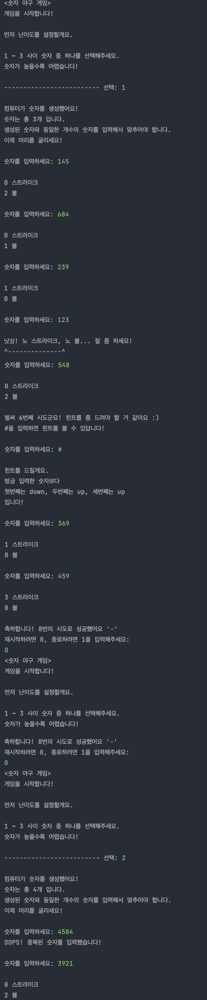
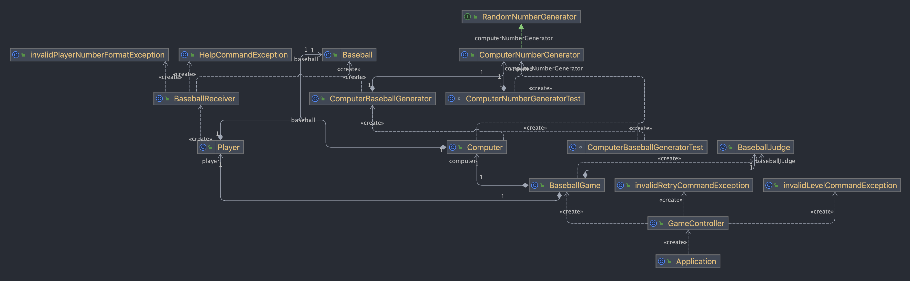

# 숫자 야구 게임 

---

## ⚾️ 설명
랜덤으로 생성되는 서로 다른 3개 이상의 숫자를 맞추는 게임이다.

## 🎯 기능 구현 목록 

### 입력 기능
  - (예외) 1 ~ 9까지의 3자리 수가 아닌 경우(문자, 0 포함, 자리수 초과)
  - (예외) 중복 숫자를 입력한 경우
### 게임 기능 
  - 컴퓨터 생성 숫자 기능 (1 ~ 9 까지의 서로 다른 3자리의 자연수를 생성)
  - 스트라이크를 판별하는 기능 (숫자와 자리수 모두 일치)
  - 볼을 판별하는 기능 (숫자 일치, 자리수 불일치)
  - 낫싱을 판별하는 기능 (숫자와 자리수 모두 불일치)
  - 난이도 선정 기능 (난이도에 따라 자리수 설정을 다르게 한다)
  - 힌트 기능 (이전에 입력한 숫자와 비교하여 각 숫자의 up/down을 제시한다)
  - 치트키 기능 (입력한 자리수의 숫자를 보여준다)
### 출력 기능
  - 게임 안내 출력 기능 (게임 시작, 게임 재시작, 힌트, 치트키, 종료)
### 종료 기능
  - 라운드를 종료 후 재시작 or 종료를 묻는 기능 

## 🎈 개발 환경 
- JDK 17 or later SE
- IntelliJ
- Mac OS

## 💻 출력 예시

## 💻 UML DIAGRAM

